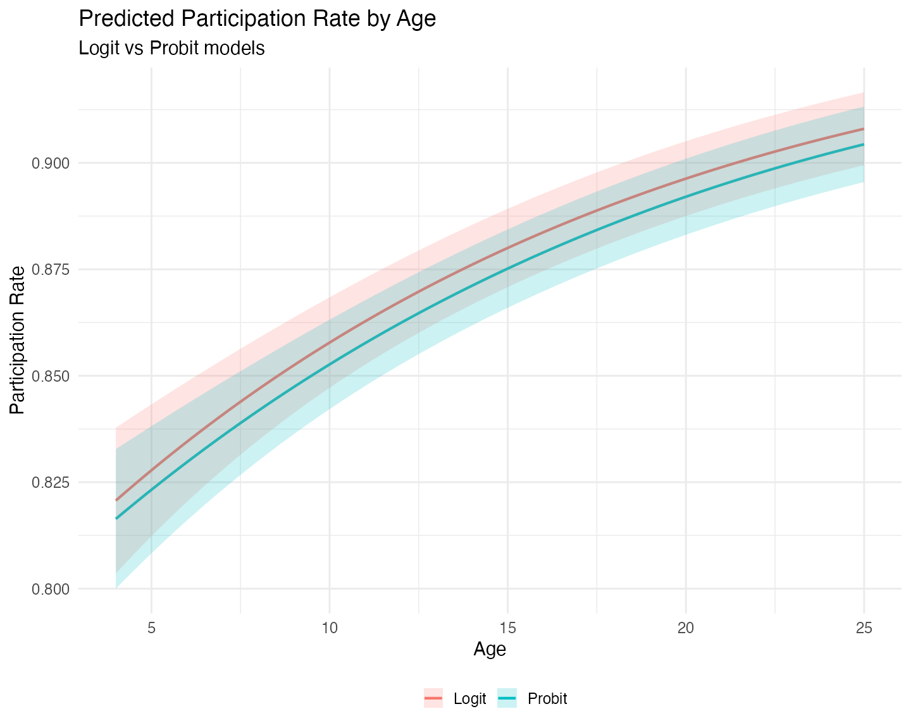
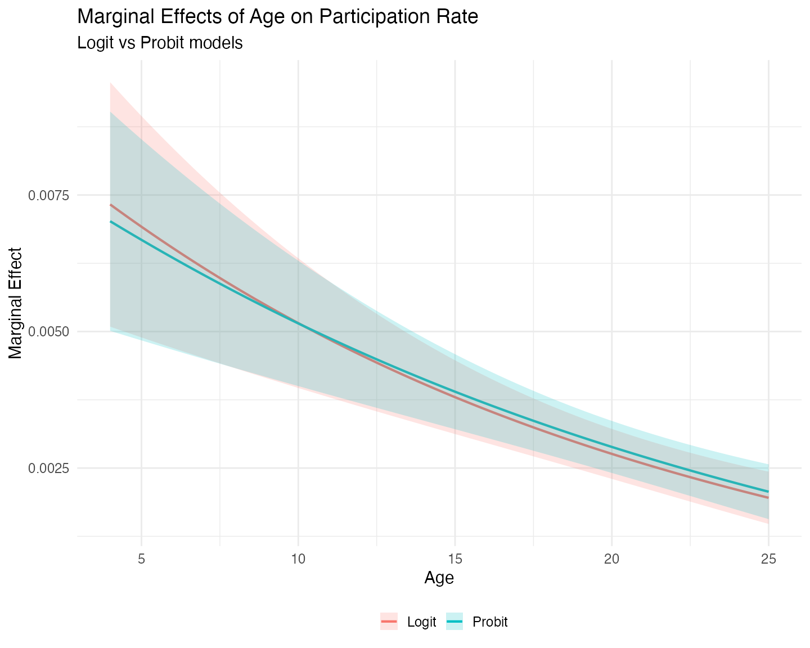
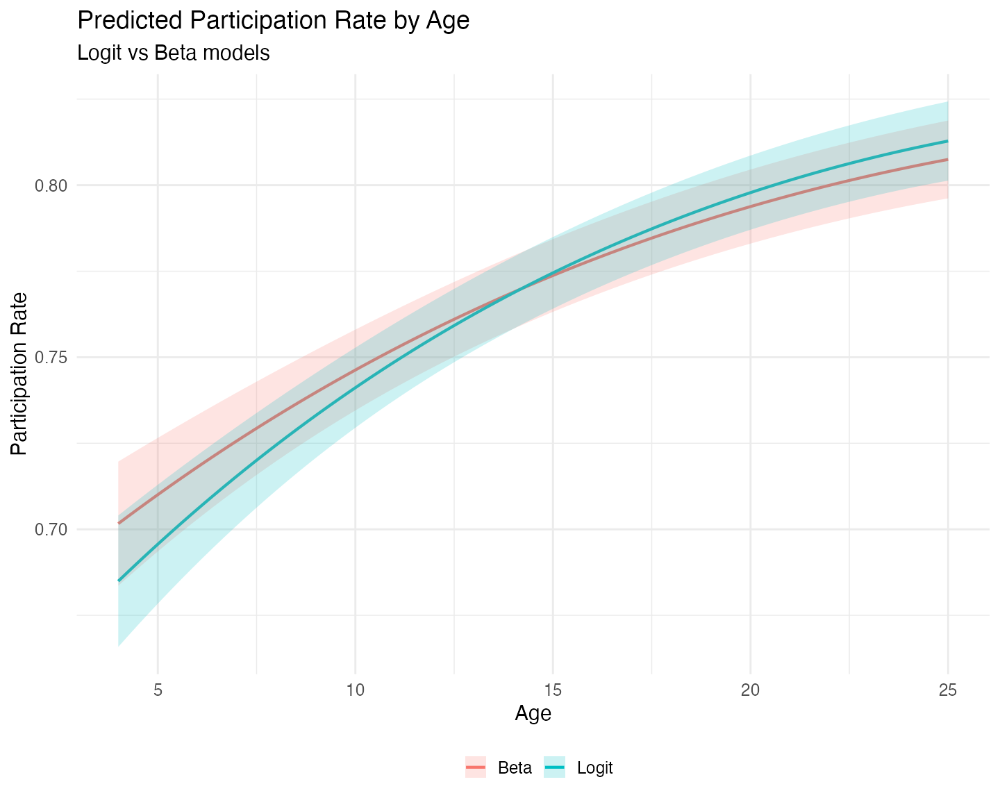
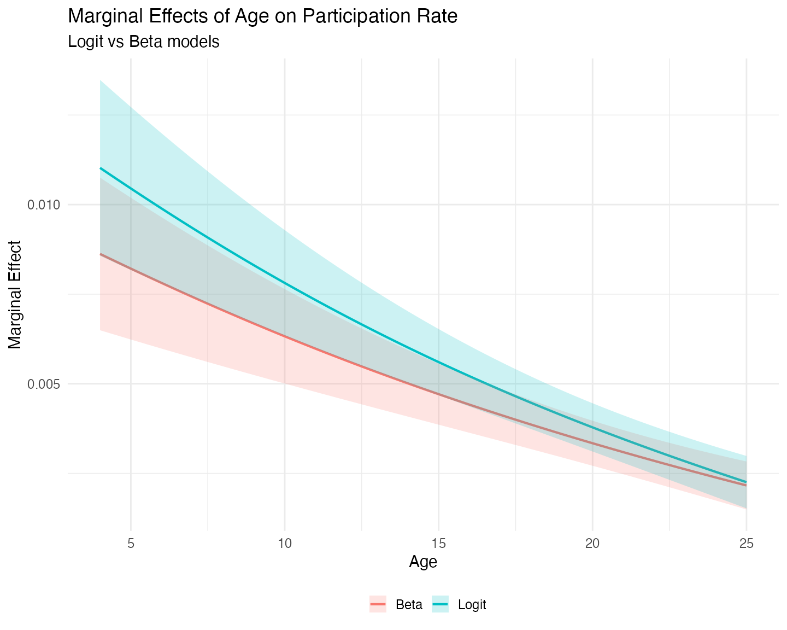

# Fractional Response Outcomes

``` r

library(mlmodels)
library(marginaleffects)
library(dplyr)
#> 
#> Attaching package: 'dplyr'
#> The following objects are masked from 'package:stats':
#> 
#>     filter, lag
#> The following objects are masked from 'package:base':
#> 
#>     intersect, setdiff, setequal, union
library(ggplot2)
```

## Introduction

Fractional response variables – outcomes that take values in the unit
interval \[0, 1\] – are common in applied research. Examples include
employment rates, participation rates in pension plans, debt-to-asset
ratios, and market shares. Modeling these variables correctly is
challenging because they are bounded and often exhibit
heteroskedasticity that depends on the conditional mean.

Ordinary least squares (OLS) is invalid in this setting. Not only are
the predicted values not constrained to the unit interval, but the
assumption of constant variance is clearly violated. Moreover, the
linear functional form is typically misspecified for a bounded dependent
variable. Before Papke and Wooldridge (1996), a common practice was to
apply a log-odds transformation, `log(y/(1-y))`, and estimate the model
by OLS. This approach has two serious drawbacks. First, it is undefined
when the outcome takes values of 0 or 1. Second, even when it can be
computed, recovering predicted values or marginal effects on the
original scale of `y` requires complex nonlinear re-transformation of
the parameters.

When boundary values were present, researchers sometimes turned to
Berkson’s minimum chi-square estimator. However, this method is not
valid when the observed proportions are themselves continuous (or
derived from continuous underlying variables), which is the typical case
in modern microeconomic data.

These limitations motivated the search for better estimators. Papke and
Wooldridge (1996) showed that **quasi-maximum likelihood estimation**
(QMLE) based on the logistic (logit) or standard normal (probit)
cumulative distribution function provides consistent estimates of the
conditional mean parameters, even though the data are fractional and the
Bernoulli variance assumption is generally incorrect. Because the
information matrix identity does not hold, robust (sandwich) standard
errors are required for valid inference.

When the outcome is strictly fractional (no observations at 0 or 1), the
**Beta regression model** becomes an attractive alternative. It provides
a full maximum likelihood estimator under the assumption that `y`
follows a Beta distribution, which is often more efficient than the
quasi-likelihood approach. However, like the log-odds transformation,
the Beta model is undefined at the boundaries and automatically drops
observations with `y = 0` or `y = 1`.

This potential gain in efficiency comes at a cost: the Beta model is
**not robust** to distributional misspecification. If the Beta
distributional assumption fails, the estimator can easily become
inconsistent for the parameters of interest.

This vignette compares these three approaches — **logit and probit
QMLE** (which can handle boundary values) and **Beta MLE** (which
cannot) — using the classic 401(k) participation data from Papke and
Wooldridge (1996).

## QMLE with Observations at the Boundary

When the fractional outcome contains observations at the boundaries
(exactly 0 or 1), the Beta model is no longer feasible, since it is only
defined on the open interval (0, 1). In these cases, the quasi-maximum
likelihood (QMLE) framework proposed by Papke and Wooldridge (1996)
becomes the preferred approach.

The central insight of Papke and Wooldridge is that we can treat the
observed fraction as if it were a Bernoulli outcome for the purpose of
estimating the conditional mean, even though the data are aggregated
proportions. Both the logistic (logit) and standard normal (probit)
cumulative distribution functions ensure that predicted values lie
naturally within the unit interval \[0, 1\]. Under correct specification
of the linear index, the resulting estimators are consistent for the
parameters of the conditional mean, regardless of the true conditional
variance.

However, because the implicit Bernoulli variance assumption is usually
incorrect for fractional data, the information matrix identity does not
hold. Consequently, standard errors based on the observed information
matrix (`oim`) or outer product of gradients (`opg`) are generally
invalid. **Robust (sandwich) standard errors** are essential for
reliable inference.

The `mlmodels` package supports fractional responses in both
[`ml_logit()`](https://alfisankipan.github.io/mlmodels/reference/ml_logit.md)
and
[`ml_probit()`](https://alfisankipan.github.io/mlmodels/reference/ml_probit.md).
In addition, we automatically warn users when they attempt
post-estimation inference using `oim` or `opg` standard errors on
fractional outcomes. For a detailed discussion of the different
variance-covariance estimators available, see the vignette
[Variance-Covariance Estimation in
`mlmodels`](https://alfisankipan.github.io/mlmodels/articles/mlmodels-variance.md).

### Estimation with Logit and Probit

We illustrate this approach using the full 401(k) participation dataset
from Papke and Wooldridge (1996), which includes observations at both 0
and 1. We estimate their preferred specification (Table III, column 4),
which includes quadratic terms in `mrate`, `log(totemp)`, and `age`.

``` r

data("pw401k")

# Store formula for multiple use
form_full <- prate ~ mrate + I(mrate^2) + 
                    log(totemp) + I(log(totemp)^2) + 
                    age + I(age^2) + sole

# Estimation
logit_full  <- ml_logit(form_full, data = pw401k)
probit_full <- ml_probit(form_full, data = pw401k)

# Display the results
summary(logit_full,  vcov.type = "robust")
#> 
#> Maximum Likelihood Model
#>  Type: Homoskedastic Fractional Response Logit 
#> ---------------------------------------
#> Call:
#> ml_logit(value = prate ~ mrate + I(mrate^2) + log(totemp) + I(log(totemp)^2) + 
#>     age + I(age^2) + sole, data = pw401k)
#> 
#> Log-Likelihood: -1713.09 
#> 
#> Wald significance tests:
#>  all: Chisq(7) = 880.958, Pr(>Chisq) = < 1e-8
#> 
#> Variance type: Robust
#> ---------------------------------------
#>                            Estimate Std. Error z value Pr(>|z|)     
#> Value (prate):  
#>   value::(Intercept)       5.10529    0.41569  12.281  < 2e-16 ***
#>   value::mrate             1.66502    0.10425  15.972  < 2e-16 ***
#>   value::I(mrate^2)       -0.33209    0.02564 -12.951  < 2e-16 ***
#>   value::log(totemp)      -1.03058    0.10972  -9.393  < 2e-16 ***
#>   value::I(log(totemp)^2)  0.05363    0.00707   7.587 3.27e-14 ***
#>   value::age               0.05482    0.00770   7.123 1.05e-12 ***
#>   value::I(age^2)         -0.00063    0.00018  -3.557 0.000375 ***
#>   value::sole              0.06425    0.04984   1.289 0.197305    
#> ---------------------------------------
#> Signif. codes:  0 '***' 0.001 '**' 0.01 '*' 0.05 '.' 0.1 ' ' 1
#> ---
#> Number of observations:4734 (Successes: 4116.51, Failures: 617.4899)
#> Pseudo R-squared - Cor.Sq.: 0.1971 McFadden: 0.06546
#> AIC: 3442.17  BIC: 3493.87
summary(probit_full, vcov.type = "robust")
#> 
#> Maximum Likelihood Model
#>  Type: Homoskedastic Fractional Response Probit 
#> ---------------------------------------
#> Call:
#> ml_probit(value = prate ~ mrate + I(mrate^2) + log(totemp) + 
#>     I(log(totemp)^2) + age + I(age^2) + sole, data = pw401k)
#> 
#> Log-Likelihood: -1712.98 
#> 
#> Wald significance tests:
#>  all: Chisq(7) = 891.991, Pr(>Chisq) = < 1e-8
#> 
#> Variance type: Robust
#> ---------------------------------------
#>                             Estimate Std. Error z value Pr(>|z|)     
#> Value (prate):  
#>   value::(Intercept)       2.843323   0.220391  12.901  < 2e-16 ***
#>   value::mrate             0.854405   0.053175  16.068  < 2e-16 ***
#>   value::I(mrate^2)       -0.171649   0.013210 -12.994  < 2e-16 ***
#>   value::log(totemp)      -0.551960   0.058621  -9.416  < 2e-16 ***
#>   value::I(log(totemp)^2)  0.028701   0.003788   7.577 3.53e-14 ***
#>   value::age               0.029139   0.003985   7.313 2.61e-13 ***
#>   value::I(age^2)         -0.000339   0.000091  -3.737 0.000186 ***
#>   value::sole              0.045994   0.026419   1.741 0.081696 .  
#> ---------------------------------------
#> Signif. codes:  0 '***' 0.001 '**' 0.01 '*' 0.05 '.' 0.1 ' ' 1
#> ---
#> Number of observations:4734 (Successes: 4116.51, Failures: 617.4899)
#> Pseudo R-squared - Cor.Sq.: 0.1966 McKelvey & Zavoina: 0.1438
#> AIC: 3441.95  BIC: 3493.65
```

Our estimates from the fractional response logit model match those
reported in the original paper (after accounting for rounding). For
example, the coefficient on `log(totemp)` is `-1.03058` in our logit
model, which rounds to `-1.031` or `-1.030` depending on the convention
used. All other coefficients and robust standard errors align with the
published results.

It is worth noting that the logit and probit coefficients are not
directly comparable due to the different scaling of the underlying
latent variable (logistic variance ≈ 3.29 versus standard normal
variance = 1). What *is* comparable – and more relevant for
interpretation – are the predicted participation rates and marginal
effects. We turn to these next.

### Predicted Probabilities and Marginal Effects

To compare the substantive implications of the two models, we compute
predicted participation rates and the marginal effect of `age` across a
range of values, using functions from the `marginaleffects` package. We
evaluate the predictions and marginal effects for both models at the
mean values of all other covariates.

In the data, `age` represents the number of years that the pension plan
has been in place at the company. Looking at the summary statistics we
see that the minimum is 4 years, the 3rd quartile is 17 years, and the
maximum is 76 years. For our range of values we select, then, values
that are representative for most of the distribution, and make `age`
range from 4 to 25 years.

``` r

# Grid focused on the main mass of the data (covers up to ~Q3 + a bit)
# You can pass either fitted model in `model`.
newdata <- datagrid(model = logit_full,
                    age = seq(4, 25, length.out = 80),
                    FUN = mean)

# Predictions (participation rate)
pred_logit  <- predictions(logit_full,  newdata = newdata, vcov = "robust")
pred_probit <- predictions(probit_full, newdata = newdata, vcov = "robust")

# Marginal effects of age
me_logit  <- slopes(logit_full,  variables = "age", newdata = newdata, vcov = "robust")
me_probit <- slopes(probit_full, variables = "age", newdata = newdata, vcov = "robust")
```

We now plot the predicted participation rates:

``` r

# Form Long dataset with both predictions and factor variable Model.
probs <- bind_rows(
  pred_logit |> mutate(Model = "Logit"),
  pred_probit  |> mutate(Model = "Probit")
)

ggplot(probs, aes(x = age, y = estimate, color = Model, fill = Model)) +
  geom_line(linewidth = 1) +
  geom_ribbon(aes(ymin = conf.low, ymax = conf.high), alpha = 0.2, color = NA) +
  labs(title = "Predicted Participation Rate by Age",
       subtitle = "Logit vs Probit models",
       x = "Age", 
       y = "Participation Rate",
       color = "",
       fill = "") +
  theme_minimal(base_size = 15) + 
  theme(legend.position = "bottom")
```



The logit model consistently predicts **higher participation rates**
than the probit model. We also observe that the logit model exhibits
**greater uncertainty** at low plan ages, visible in the wider
confidence bands on the left side of the graph. This pattern is typical
because the logistic distribution has heavier tails than the standard
normal. If we had extended the grid to the upper limits of `age`, we
would likely have observed wider uncertainty there as well.

Turning to marginal effects:

``` r

mes <- bind_rows(
  me_logit |> mutate(Model = "Logit"),
  me_probit  |> mutate(Model = "Probit")
)

ggplot(mes, aes(x = age, y = estimate, color = Model, fill = Model)) +
  geom_line(linewidth = 1) +
  geom_ribbon(aes(ymin = conf.low, ymax = conf.high), alpha = 0.2, color = NA) +
  labs(title = "Marginal Effects of Age on Participation Rate",
       subtitle = "Logit vs Probit models",
       x = "Age", 
       y = "Marginal Effect",
       color = "",
       fill = "") +
  theme_minimal(base_size = 15) + 
  theme(legend.position = "bottom")
```



The marginal effect of plan age on participation is positive but
declining in both models. The two curves cross around 11 years – before
the mean plan age (13.14). At very young plans, the logit model implies
a stronger positive effect of age. After the crossing point, the probit
model shows a slightly larger marginal effect. However, the differences
between the two models are not significant, both statistically and
practically.

## Strict Fractional Responses

To provide a comparison between all estimators, we now are going to
estimate a fractional response logit model and a beta model, on only
those observations that are between 0 and 1 – strict fractional
responses. The reason is that when the data shows this type of
fractional responses the **Beta model** becomes attractive because of
its usual superior efficiency, as long as the distributional assumption
is correct.

``` r

# There are no outcomes at 0, only at 1. Subset accordingly

logit_frac <- ml_logit(form_full, data = pw401k, subset = prate < 1)
beta_frac  <- ml_beta(form_full,  data = pw401k, subset = prate < 1)
#> ℹ Improving initial values by scaling (factor = 0.5).
#> ℹ Initial log-likelihood: -311.974
#> ℹ Final scaled log-likelihood: 79.945

summary(logit_frac, vcov.type = "robust")
#> 
#> Maximum Likelihood Model
#>  Type: Homoskedastic Fractional Response Logit 
#> ---------------------------------------
#> Call:
#> ml_logit(value = prate ~ mrate + I(mrate^2) + log(totemp) + I(log(totemp)^2) + 
#>     age + I(age^2) + sole, data = pw401k, subset = prate < 1)
#> 
#> Log-Likelihood: -1426.29 
#> 
#> Wald significance tests:
#>  all: Chisq(7) = 352.993, Pr(>Chisq) = < 1e-8
#> 
#> Variance type: Robust
#> ---------------------------------------
#>                            Estimate Std. Error z value Pr(>|z|)     
#> Value (prate):  
#>   value::(Intercept)       3.51819    0.35290   9.969  < 2e-16 ***
#>   value::mrate             0.81486    0.09870   8.256  < 2e-16 ***
#>   value::I(mrate^2)       -0.20171    0.02533  -7.963 1.68e-15 ***
#>   value::log(totemp)      -0.70323    0.09483  -7.416 1.21e-13 ***
#>   value::I(log(totemp)^2)  0.03762    0.00614   6.124 9.10e-10 ***
#>   value::age               0.05800    0.00618   9.388  < 2e-16 ***
#>   value::I(age^2)         -0.00086    0.00014  -6.186 6.17e-10 ***
#>   value::sole             -0.19903    0.04011  -4.962 6.99e-07 ***
#> ---------------------------------------
#> Signif. codes:  0 '***' 0.001 '**' 0.01 '*' 0.05 '.' 0.1 ' ' 1
#> ---
#> Number of observations:2711 (Successes: 2093.51, Failures: 617.4899)
#> Pseudo R-squared - Cor.Sq.: 0.1434 McFadden: 0.01949
#> AIC: 2868.57  BIC: 2915.81
summary(beta_frac,  vcov.type = "robust")
#> 
#> Maximum Likelihood Model
#>  Type: Homoskedastic Beta Model 
#> ---------------------------------------
#> Call:
#> ml_beta(value = prate ~ mrate + I(mrate^2) + log(totemp) + I(log(totemp)^2) + 
#>     age + I(age^2) + sole, data = pw401k, subset = prate < 1)
#> 
#> Log-Likelihood: 1677.81 
#> 
#> Wald significance tests:
#>  all: Chisq(7) = 351.410, Pr(>Chisq) = < 1e-8
#> 
#> Variance type: Robust
#> ---------------------------------------
#>                            Estimate Std. Error z value Pr(>|z|)     
#> Value (prate):  
#>   value::(Intercept)       2.99043    0.32638   9.162  < 2e-16 ***
#>   value::mrate             0.90356    0.09600   9.412  < 2e-16 ***
#>   value::I(mrate^2)       -0.21881    0.02716  -8.057 7.80e-16 ***
#>   value::log(totemp)      -0.57702    0.08733  -6.608 3.91e-11 ***
#>   value::I(log(totemp)^2)  0.03076    0.00564   5.455 4.89e-08 ***
#>   value::age               0.04639    0.00557   8.332  < 2e-16 ***
#>   value::I(age^2)         -0.00065    0.00012  -5.229 1.70e-07 ***
#>   value::sole             -0.10352    0.04001  -2.587  0.00968 ** 
#> Scale (log(phi)):  
#>   scale::lnphi             1.87118    0.03502  53.429  < 2e-16 ***
#> ---------------------------------------
#> Signif. codes:  0 '***' 0.001 '**' 0.01 '*' 0.05 '.' 0.1 ' ' 1
#> ---
#> Number of observations:2711 Deg. of freedom: 2703
#> Pseudo R-squared - Cor.Sq.: 0.1051
#> AIC: -3337.62  BIC: -3284.48 
#> Precision Param.: 6.50
```

#### Note on the Log-Likelihood of the Beta Model

You may have noticed that the log-likelihood for the Beta model is
**positive** (approximately +1677.81 in this estimation). This is
perfectly normal and does not indicate any problem.

The Beta distribution is defined only on the open interval (0, 1). When
the precision parameter `phi` is large – here we estimate `phihat` ≈
6.50 – the density can exceed 1 near the boundaries. As a result, the
log-density for many observations is positive, and the overall
log-likelihood can easily be positive as well.

In contrast, the logit and probit models are based on a quasi-likelihood
approach and typically produce negative log-likelihood values. Because
of these differences in scale, the log-likelihood (and therefore AIC and
BIC) are directly comparable between logit and probit, but not with the
Beta model.

We also shouldn’t be tempted to compare the z-statistics directly,
because they **are not strictly comparable** across models. The z-value
depends on both the magnitude of the coefficient and its standard error.
While the Beta model is generally more efficient when its distributional
assumption holds (producing smaller standard errors on average), the
coefficients themselves also differ in scale and interpretation between
the logit and beta specifications. As a result, some coefficients may
show higher z-values in the Beta model, while others show lower ones.

Like before, we **can** compare their predictions and marginal effects.
We follow the same methodology as before, but we calculate a new grid,
so that the means can be calculated on the reduced sample:

``` r

# New grid to recalculate the means to the reuced sample.
newdata <- datagrid(model = logit_frac,
                    age = seq(4, 25, length.out = 80),
                    FUN = mean)

# Predictions (participation rate)
pred_logit  <- predictions(logit_frac,  newdata = newdata, vcov = "robust")
pred_beta <- predictions(beta_frac, newdata = newdata, vcov = "robust")

# Marginal effects of age
me_logit  <- slopes(logit_frac,  variables = "age", newdata = newdata, vcov = "robust")
me_beta <- slopes(beta_frac, variables = "age", newdata = newdata, vcov = "robust")
```

Let us compare the predited participation rates:

``` r

probs <- bind_rows(
  pred_logit |> mutate(Model = "Logit"),
  pred_beta  |> mutate(Model = "Beta")
)

ggplot(probs, aes(x = age, y = estimate, color = Model, fill = Model)) +
  geom_line(linewidth = 1) +
  geom_ribbon(aes(ymin = conf.low, ymax = conf.high), alpha = 0.2, color = NA) +
  labs(title = "Predicted Participation Rate by Age",
       subtitle = "Logit vs Beta models",
       x = "Age", 
       y = "Participation Rate",
       color = "",
       fill = "") +
  theme_minimal(base_size = 15) + 
  theme(legend.position = "bottom")
```



On the reduced sample of strictly fractional responses
(`0 < prate < 1`), the predicted participation rates from the logit and
Beta models are quite close across the range of plan age. The Beta model
does not show a dramatic gain in precision or efficiency in this
particular application. While the Beta distribution can sometimes
provide more efficient estimates when its assumptions hold, the
quasi-likelihood logit model remains competitive and is often preferred
when robustness to distributional misspecification is a concern.

We now turn to the marginal effects:

``` r

mes <- bind_rows(
  me_logit |> mutate(Model = "Logit"),
  me_beta  |> mutate(Model = "Beta")
)

ggplot(mes, aes(x = age, y = estimate, color = Model, fill = Model)) +
  geom_line(linewidth = 1) +
  geom_ribbon(aes(ymin = conf.low, ymax = conf.high), alpha = 0.2, color = NA) +
  labs(title = "Marginal Effects of Age on Participation Rate",
       subtitle = "Logit vs Beta models",
       x = "Age", 
       y = "Marginal Effect",
       color = "",
       fill = "") +
  theme_minimal(base_size = 15) + 
  theme(legend.position = "bottom")
```



The marginal effect of plan age on participation is positive but
declining in both models, as expected given the quadratic specification.
The two curves cross (or come very close to crossing) around age 25, the
right limit of our grid. At very young plans the Beta model implies a
stronger positive effect of age, while at older plans the logit model
shows a slightly larger marginal effect.

Interestingly, the confidence intervals for both models are narrowest
around age 21–23, well beyond the mean plan age of 12.07 years in the
reduced sample. This occurs because the quadratic term in the model
shifts the region of lowest uncertainty to the right.

Overall, the differences between the logit and Beta models are modest in
this application.

## Concluding Remarks

The `mlmodels` package provides three estimators for fractional response
outcomes:

- [`ml_logit()`](https://alfisankipan.github.io/mlmodels/reference/ml_logit.md)
  and
  [`ml_probit()`](https://alfisankipan.github.io/mlmodels/reference/ml_probit.md)
  – These **quasi-maximum likelihood estimators** (QMLE) are consistent
  for the conditional mean even when the outcome includes boundary
  values (0 or 1). Because the implicit Bernoulli variance is usually
  incorrect, **robust standard errors are strongly recommended**.
- [`ml_beta()`](https://alfisankipan.github.io/mlmodels/reference/ml_beta.md)
  — This is a full maximum likelihood estimator that is typically more
  efficient when the outcome is strictly fractional (values strictly
  between 0 and 1) and the Beta distributional assumption holds
  reasonably well. However, it is not valid when the outcome includes
  boundary values, and
  [`ml_beta()`](https://alfisankipan.github.io/mlmodels/reference/ml_beta.md)
  automatically drops them.

In this vignette we compared these approaches using the classic 401(k)
participation data from Papke and Wooldridge (1996).

When boundary values are present, both logit and probit produce very
similar predicted participation rates and marginal effects. The logit
model tends to show slightly wider uncertainty in the tails, but overall
the substantive conclusions from the two models are nearly identical.

On the strictly fractional subsample, the Beta and logit models again
yield very similar predictions and marginal effects. While the Beta
model can be more efficient when its distributional assumption is
appropriate, we did not observe a dramatic gain in this application –
partly because we used robust standard errors for both models. When the
researcher is confident in the Beta assumption, model-based (`oim`)
standard errors can be used and will often be more precise.

Ultimately, `mlmodels` gives you flexible, well-documented tools to
choose the most appropriate model for your data and research goals –
whether you need robustness to boundary values (`ml_logit`/`ml_probit`)
or potential efficiency gains under stricter assumptions (`ml_beta`).

Happy modeling!

## References

Papke, L. E., & Wooldridge, J. M. (1996). “Econometric methods for
fractional response variables with an application to 401(k) plan
participation rates.” *Journal of Applied Econometrics*, 11(6), 619–632.
<https://doi.org/10.1002/(SICI)1099-1255(199611)11:6%3C619::AID-JAE418%3E3.0.CO;2-1>
