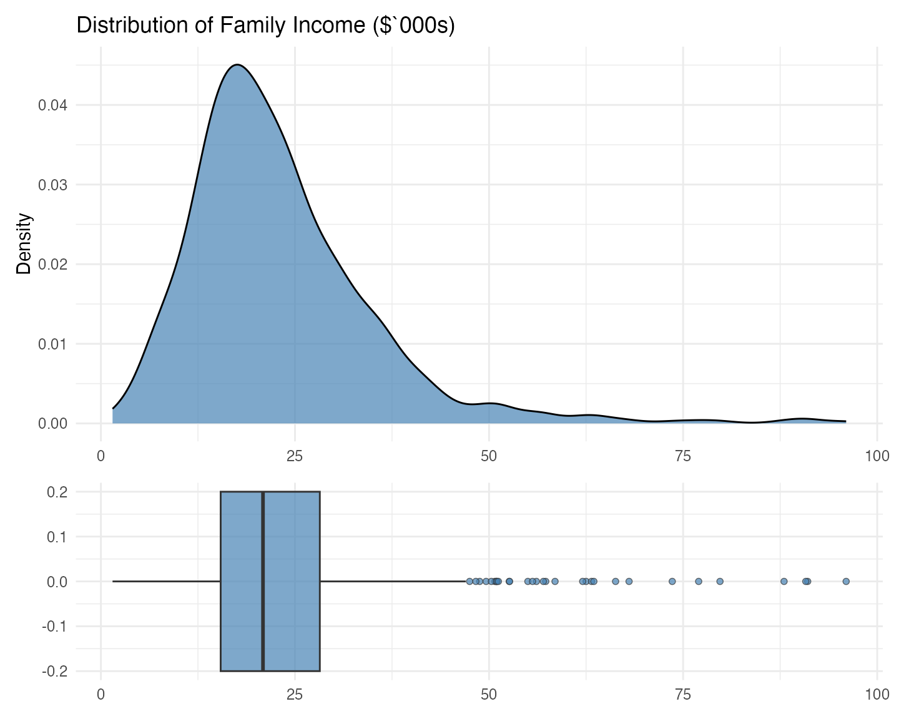
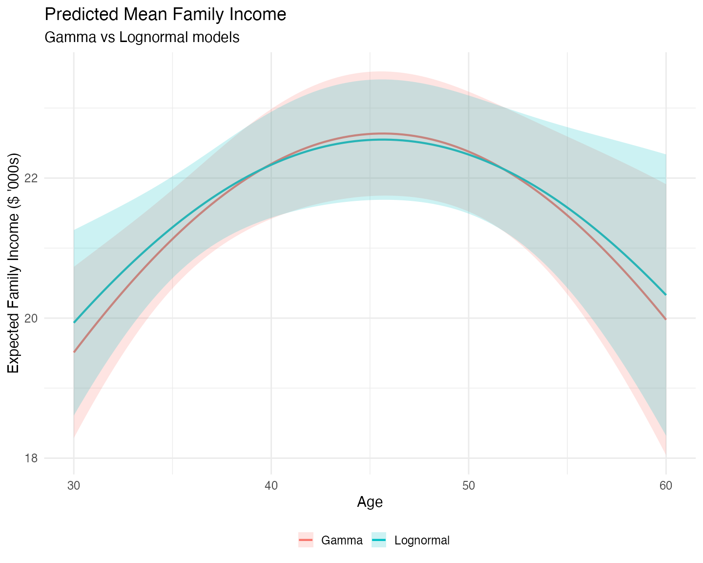
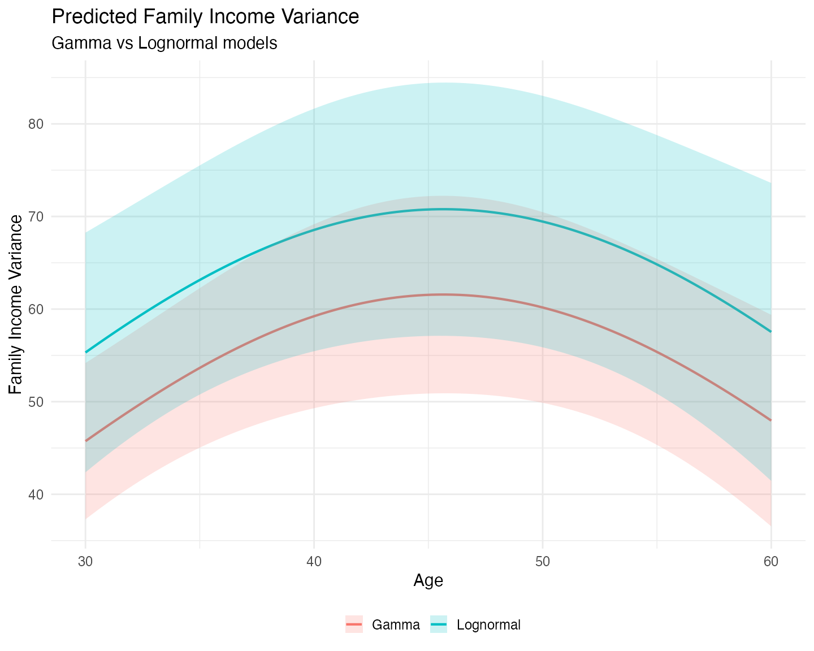

# Gamma versus Lognormal

``` r

suppressMessages({
  library(mlmodels)
  library(dplyr)
  library(e1071)
  library(ggplot2)
  library(marginaleffects)
  library(patchwork)
})
```

## Introduction

Positive and right-skewed variables (such as income, expenditures, or
durations) are common in applied research. Two popular distributions for
modeling them are the **Gamma** and the **Lognormal**. Both can produce
similar predictions for the conditional mean, but normally differ
substantially in how they model variance and tail behavior.

There is also a subtle difference in their flexibility to adapt the
**shape of the distribution**:

- The **Gamma** distribution can take on a wide range of shapes
  depending on its shape parameter: from very heavily skewed (low shape)
  to almost symmetric (high shape).

- The **Lognormal** distribution is always right-skewed and has a more
  rigid functional form, because it is simply the exponential of a
  normal distribution. While changing the variance parameter makes the
  distribution wider or narrower, the overall shape of the density
  remains structurally fixed. This rigidity often forces the lognormal
  to assign more probability mass near zero than the data actually
  exhibits, which in turn requires a heavier right tail to match the
  observed mean.

### Exploring the Outcome Variable

Given these differences it is always a good idea to explore the outcome
variable. We do it two ways. The first one is graphical, using a density
and a boxplot.

``` r

data(mroz)

# Scale faminc into thousands for smaller values.
mroz$incthou <- mroz$faminc / 1000

# Use ggplot to create both plots

p_density <- ggplot(mroz, aes(x = incthou)) +
  geom_density(fill = "steelblue", alpha = 0.7) +
  labs(title = "Distribution of Family Income ($`000s)", x = NULL, y = "Density") +
  theme_minimal(base_size = 15)

p_box <- ggplot(mroz, aes(x = incthou)) +
  geom_boxplot(fill = "steelblue", alpha = 0.7, width = 0.4, outlier.shape = 21) +
  labs(x = NULL, y = NULL) +
  theme_minimal(base_size = 15)

# Use patchwork to put them together, one on top of the other.
p_density / p_box + plot_layout(heights = c(2, 1))
```



Both the density and the boxplot show us that, indeed, the distribution
is right skewed, with a long right tail. The density, however, shows us
that, if it weren’t for that long right tail, the distribution would be
quite symmetric, with a mode around \$16 – \$18 thousand. The boxplot
further shows that the median is slightly higher than that mode, clearly
pushed that way by the observations on the right tail.

Besides a graphical analysis we do a numerical one, getting some summary
statistics:

``` r

# Store the density to get the mode.
d <- density(mroz$incthou, na.rm = TRUE)

mroz |> 
  summarise(
    Min = min(incthou),
    Q1 = quantile(incthou, probs = 0.25),
    Median = median(incthou),
    Q3 = quantile(incthou, probs = 0.75),
    Max = max(incthou),
    Mean = mean(incthou),
    SD = sd(incthou),
    Mode = d$x[which.max(d$y)],
    Skewness = skewness(incthou, type = 3) # Alternative moments::skewness
  )
#>   Min     Q1 Median   Q3 Max     Mean      SD     Mode Skewness
#> 1 1.5 15.428  20.88 28.2  96 23.08059 12.1902 17.52294   1.8976
```

The summary statistics reinforce the visual impression. The mean
(\$23.08 thousand) is substantially higher than the median (\$20.90
thousand), as expected in a right-skewed distribution. More
interestingly, the width of the first quartile (from the minimum to Q1)
is almost as large as the interquartile range itself. This indicates
that the lower part of the distribution is **not heavily concentrated
near zero** – there is meaningful spread even in the bottom 25% of
families.

This structure is more naturally compatible with the **Gamma**
distribution, which is flexible in the lower tail. In contrast, the
**Lognormal** distribution tends to pile up probability mass close to
zero and then compensate with a heavier right tail. Because this
variable does not exhibit strong concentration near zero, the Lognormal
is forced to over-stretch its tail, which makes us expect that it will
predict higher variances than the Gamma model.

## Model Estimation

We estimate both a **Gamma** and a **Lognormal** model using very
similar syntax – this consistency is intentional in `mlmodels`.

``` r

# Gamma model
fit_gamma <- ml_gamma(incthou ~ age + I(age^2) + huswage + educ + unem + kidslt6,
                      data = mroz)

# Lognormal model
fit_lognormal <- ml_lm(log(incthou) ~ age + I(age^2) + huswage + educ + unem + kidslt6,
                       data = mroz)
```

Notice how easy it is to switch between distributions: you only need to
change the estimator name (`ml_gamma` vs `ml_lm`) while keeping the rest
of the formula structure the same.

**Important note on the lognormal model**

For a lognormal model, always use
[`ml_lm()`](https://alfisankipan.github.io/mlmodels/reference/ml_lm.md)
on the log-transformed outcome (`log(incthou)`), as shown above. **Do
not** manually transform the variable before fitting. If you pass a
pre-logged variable,
[`ml_lm()`](https://alfisankipan.github.io/mlmodels/reference/ml_lm.md)
has no way of knowing you are estimating a lognormal model. This would
lead to incorrect response predictions and variance predictions (they
would refer to the log scale instead of the original scale).

### Estimates

We display the estimates using
[`summary()`](https://rdrr.io/r/base/summary.html) with robust standard
errors.

``` r

summary(fit_gamma, vcov.type = "robust")
#> 
#> Maximum Likelihood Model
#>  Type: Homoskedastic Gamma Model 
#> ---------------------------------------
#> Call:
#> ml_gamma(value = incthou ~ age + I(age^2) + huswage + educ + 
#>     unem + kidslt6, data = mroz)
#> 
#> Log-Likelihood: -2554.46 
#> 
#> Wald significance tests:
#>  all: Chisq(6) = 342.798, Pr(>Chisq) = < 1e-8
#> 
#> Variance type: Robust
#> ---------------------------------------
#>                       Estimate Std. Error z value Pr(>|z|)     
#> Value (incthou):  
#>   value::(Intercept)  0.85756    0.37648   2.278  0.02274 *  
#>   value::age          0.05541    0.01735   3.194  0.00140 ** 
#>   value::I(age^2)    -0.00061    0.00020  -3.068  0.00215 ** 
#>   value::huswage      0.07662    0.00537  14.268  < 2e-16 ***
#>   value::educ         0.04372    0.00705   6.198 5.73e-10 ***
#>   value::unem        -0.01149    0.00434  -2.650  0.00805 ** 
#>   value::kidslt6     -0.05936    0.02926  -2.029  0.04245 *  
#> Scale (log(nu)):  
#>   scale::lnnu         2.11891    0.07292  29.059  < 2e-16 ***
#> ---------------------------------------
#> Signif. codes:  0 '***' 0.001 '**' 0.01 '*' 0.05 '.' 0.1 ' ' 1
#> ---
#> Number of observations:753 Deg. of freedom: 746
#> Pseudo R-squared - Cor.Sq.: 0.3387 McFadden: 0.09864
#> AIC: 5124.92  BIC: 5161.91 
#> Shape Param.: 8.32  - Coef.Var.: 0.35

summary(fit_lognormal, vcov.type = "robust")
#> 
#> Maximum Likelihood Model
#>  Type: Homoskedastic Lognormal Model 
#> ---------------------------------------
#> Call:
#> ml_lm(value = log(incthou) ~ age + I(age^2) + huswage + educ + 
#>     unem + kidslt6, data = mroz)
#> 
#> Log-Likelihood: -2570.00 
#> 
#> Wald significance tests:
#>  all: Chisq(6) = 332.748, Pr(>Chisq) = < 1e-8
#> 
#> Variance type: Robust
#> ---------------------------------------
#>                       Estimate Std. Error z value Pr(>|z|)     
#> Value (log(incthou)):  
#>   value::(Intercept)  0.94682    0.39252   2.412   0.0159 *  
#>   value::age          0.04597    0.01777   2.586   0.0097 ** 
#>   value::I(age^2)    -0.00050    0.00020  -2.492   0.0127 *  
#>   value::huswage      0.07611    0.00644  11.814  < 2e-16 ***
#>   value::educ         0.04871    0.00668   7.291 3.08e-13 ***
#>   value::unem        -0.01118    0.00464  -2.407   0.0161 *  
#>   value::kidslt6     -0.07247    0.02893  -2.505   0.0122 *  
#> Scale (log(sigma)):  
#>   scale::lnsigma     -1.01881    0.04244 -24.004  < 2e-16 ***
#> ---------------------------------------
#> Signif. codes:  0 '***' 0.001 '**' 0.01 '*' 0.05 '.' 0.1 ' ' 1
#> ---
#> Number of observations: 753 
#> Residual degrees of freedom: 746 
#> Multiple R-squared: 0.511 Adjusted R-squared: 0.5071
#> AIC: 5156.00  BIC: 5193.00 
#> Residual standard error (sigma): 0.361
```

Both models produce very similar coefficient estimates in the value
(mean) equation, suggesting they capture the main relationships in
roughly the same way.

**Note on Model Fit Statistics**

You **cannot** compare the *R*² across models directly.

- The *R*² of the **Lognormal** model, measures how well the model fits
  the **natural log of income** (`log(incthou)`).
- The *R*² measures of the **Gamma** model reflect how well the model
  fits on the **original scale of income** (`incthou`).

You can, very easily, calculate an *R*² for the Lognormal model that is
directly comparable to one of the *R*² shown for the gamma model: the
correlation squared of the outcome and predicted response.

``` r

# predict the response
resp_ln <- predict(fit_lognormal)

r2_original <- cor(mroz$incthou, resp_ln$fit, use = "complete.obs")^2
round(r2_original, 4)
#> [1] 0.3457
```

We see that it is slightly higher than that of the Gamma model.

You, also, can directly compare the log-likelihood, AIC, and BIC, the
log-likelihoods are defined in terms of the actual outcome (`incthou`).
But **only if you specified the
[`log()`](https://rdrr.io/r/base/Log.html) function in the value formula
in `ml_lm`**. These measures seem to favor the Gamma model.

To formally compare the two non-nested models, we can use the **Vuong
test**:

``` r

vuongtest(fit_gamma, fit_lognormal)
#> 
#> Vuong's (1989) Test
#> --------------------------------------------------
#>   Model 1: Homoskedastic Gamma Model 
#>   Model 2: Homoskedastic Lognormal Model 
#> --------------------------------------------------
#>   z-stat:  1.493
#>   p-value: 0.1354
#> --------------------------------------------------
#>  Inconclusive test: neither model is preferred.
```

The positive value of the z statistic follows from the Gamma model (the
first one entered in the function) having a higher average
log-likelihood across observations, but it is not large enough for it to
be statistically significant, and there doesn’t seem to be a clear
winner.

## Postestimation Analysis

We have just seen how the estimates of the coefficients of the value
equation and its standard errors, are very close across both models,
which indicates that both capture the mean very closely. There may be
slight differences.

We also want to see if both model capture the variance differently.
Because the Gamma model’s flexibility to change its overall
distributional shape, and the Lognormal model is very rigid about it, we
expect that both models will not predict the variance as closely.

We are going to explore this graphically. For that purpose, we are going
to explore the relationship of the predicted mean and predicted
variance, with one of the predictors (`age`), across models.

First, we use `marginaleffects`’
[`datagrid()`](https://rdrr.io/pkg/marginaleffects/man/datagrid.html)
function to form a dataframe, with the predictors, for 100 values of
`age`, ranging from its minimum (30) to its maximum (60), and at the
average of all other predictors. We can use either model because all
that
[`datagrid()`](https://rdrr.io/pkg/marginaleffects/man/datagrid.html)
needs is to pull the dataset and the variables involved in the
estimation, and both have the same ones.

``` r

new_data <- datagrid(model = fit_gamma,           # use any model to get the structure
  age = seq(30, 60, length.out = 100),
  FUN = mean)
```

Notice the beauty of
[`datagrid()`](https://rdrr.io/pkg/marginaleffects/man/datagrid.html).
You just need to define the values for one of the predictors in the
model, and in the `FUN` argument you se what function you want to apply
to the rest. This way only `age` varies, and all other variables are
constant at their respective means.

Now we predict the mean and the variance of the outcome for both models
with
[`predictions()`](https://rdrr.io/pkg/marginaleffects/man/predictions.html)
from `marginaleffects`, to also get a confidence intervals. `reponse`
(mean) is the default prediction type in both models so we do not need
to set the `type` argument.

``` r

mean_ln <- predictions(fit_lognormal, newdata = new_data, vcov = "robust")
mean_gam <- predictions(fit_gamma, newdata = new_data, vcov = "robust")
```

To predict the variance we use `type = "var"` for the Gamma model, and
`type = "var_y"` for the Lognormal model. In a Lognormal model
`type = "var"` predicts the variance of the log scale (see
[`?predict.mlmodel`](https://alfisankipan.github.io/mlmodels/reference/predict.mlmodel.md)).

``` r

var_ln <- predictions(fit_lognormal, type = "var_y", newdata = new_data, vcov = "robust")
var_gam <- predictions(fit_gamma, type = "var", newdata = new_data, vcov = "robust")
```

### Analysis of the Mean Predictions

We are going to plot both mean predictions together. To do that, we
first bind the two predicted data frames together, while adding a
variable with each model’s name to use later in the graph.

``` r

means <- bind_rows(
  mean_gam |> mutate(Model = "Gamma"),
  mean_ln  |> mutate(Model = "Lognormal")
)

ggplot(means, aes(x = age, y = estimate, color = Model, fill = Model)) +
  geom_line(linewidth = 1) +
  geom_ribbon(aes(ymin = conf.low, ymax = conf.high), alpha = 0.2, color = NA) +
  labs(title = "Predicted Mean Family Income",
       subtitle = "Gamma vs Lognormal models",
       x = "Age", 
       y = "Expected Family Income ($ '000s)",
       color = "",
       fill = "") +
  theme_minimal(base_size = 15) + 
  theme(legend.position = "bottom")
```



Both models produce very similar predictions for the conditional mean of
family income across the age range. This aligns with the similar
coefficient estimates we saw in the value equations of both models.

However, some interesting differences emerge:

- The Lognormal model predicts a slightly higher mean at the tails
  (younger and older ages) and a slightly lower mean in the middle of
  the age distribution.
- The Lognormal predictions are relatively more uncertain at the
  extremes (wider confidence bands), while the Gamma model produces more
  stable predictions across the full age range.

If your main interest is in predictions near the center of the data
(around the mean or median of age), the practical difference is small.
However, if you care about predictions for younger or older individuals,
the Gamma model appears more efficient and stable.

### Analysis of the Predictions of the Variance

We now produce the graph for the predictons of the variance in a similar
manner:

``` r

vars <- bind_rows(
  var_gam |> mutate(Model = "Gamma"),
  var_ln  |> mutate(Model = "Lognormal")
)

ggplot(vars, aes(x = age, y = estimate, color = Model, fill = Model)) +
  geom_line(linewidth = 1) +
  geom_ribbon(aes(ymin = conf.low, ymax = conf.high), alpha = 0.2, color = NA) +
  labs(title = "Predicted Family Income Variance",
       subtitle = "Gamma vs Lognormal models",
       x = "Age", 
       y = "Family Income Variance",
       color = "",
       fill = "") +
  theme_minimal(base_size = 15) + 
  theme(legend.position = "bottom")
```



The difference between the two models becomes much clearer when we look
at predicted variance:

- The Lognormal model consistently predicts **higher variance** and
  **wider confidence intervals** across all ages compared to the Gamma
  model.
- This reflects the more rigid shape of the lognormal distribution,
  which tends to assign more probability mass near zero and compensates
  with a heavier right tail to match the observed mean.
- The Gamma model, being more flexible in its shape, produces more
  moderate variance predictions that better match the observed
  distribution of family income.

This is consistent with our earlier observation about the data: family
income is right-skewed but not heavily concentrated near zero. The Gamma
distribution handles this shape more naturally.

## Concluding Remarks

The `mlmodels` package offers two strong and convenient approaches for
modeling positive, right-skewed outcomes: the **Gamma model**
([`ml_gamma()`](https://alfisankipan.github.io/mlmodels/reference/ml_gamma.md))
and the **Lognormal model** (via
[`ml_lm()`](https://alfisankipan.github.io/mlmodels/reference/ml_lm.md)
on the log-transformed outcome).

In this application, the Gamma model performed better overall:

- It produced more stable and efficient mean predictions at the tails of
  the age distribution.
- It yielded more moderate (and likely more realistic) variance
  predictions across the entire range.

While the two models generate very similar predictions near the center
of the data, the differences become noticeable in the tails and in the
predicted dispersion.

A formal Vuong test did not find statistically significant evidence that
one model is clearly superior to the other. This is common in practice —
the “best” choice often depends on whether your main interest lies in
the conditional mean, variance, or tail behavior.

This vignette aimed to give you both a practical illustration and a
structured way to compare the two models using graphical analysis,
summary statistics, model fit measures, and prediction comparisons. We
hope it provides you with a useful framework when facing similar
positively skewed outcomes in your own work.

Happy modeling!
