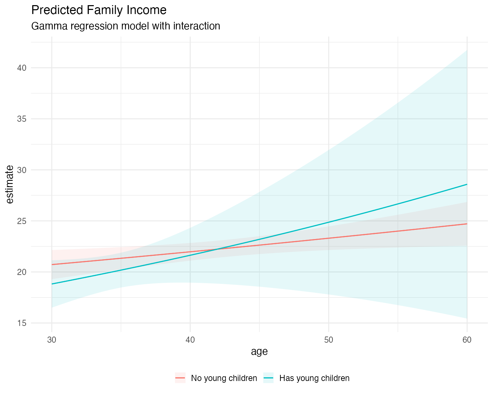
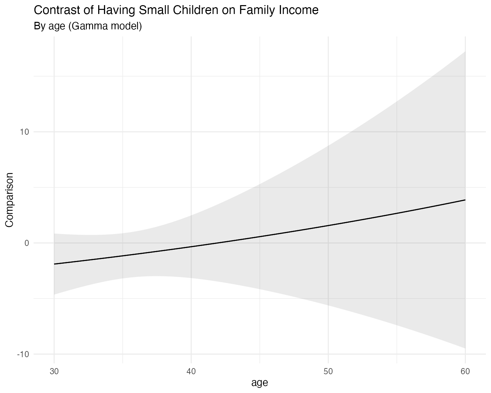

# Predictions with \`mlmodels\`

``` r

library(mlmodels)
library(marginaleffects)
```

## Introduction

One of the strongest features of the `mlmodels` package is its unified
[`predict()`](https://rdrr.io/r/stats/predict.html) method. No matter
which model you fit (`ml_lm`, `ml_poisson`, `ml_negbin`, `ml_logit`,
`ml_beta`, etc.), you can obtain predictions and standard errors using
the same consistent interface.

This vignette shows how to use
[`predict()`](https://rdrr.io/r/stats/predict.html) directly, then
demonstrates how `mlmodels` integrates with the excellent
[`marginaleffects`](https://marginaleffects.com/) package for average
predictions, marginal effects, and more.

## The `predict()` Method

The [`predict()`](https://rdrr.io/r/stats/predict.html) function in
`mlmodels` returns an object of class `predict.mlmodel`, which is a list
composed of two elements:

- `fit`: the predicted values.
- `se.fit`: standard errors calculated via the delta method using
  **analytical gradients** (only present if `se.fit = TRUE`).

By default, [`predict()`](https://rdrr.io/r/stats/predict.html) returns
**in-sample predictions**. It automatically aligns the results to the
original dataset, inserting `NA` for observations that were dropped
during estimation (due to missing values, subsetting, or invalid outcome
values for the specific model, such as non-positive values in gamma and
lognormal models, or values outside (0,1) in beta regression).

## Basic Usage

``` r

data(mroz)
mroz$incthou <- mroz$faminc / 1000

fit <- ml_lm(incthou ~ age + I(age^2) + educ + kidslt6, data = mroz)

# Default: expected value (response)
pred <- predict(fit)
head(pred$fit)
#> [1] 19.74355 18.70671 21.28132 20.98756 23.15382 23.17217

# With standard errors
pred_se <- predict(fit, se.fit = TRUE)
head(data.frame(fit = pred_se$fit, se = pred_se$se.fit))
#>        fit        se
#> 1 19.74355 0.8506750
#> 2 18.70671 1.2325354
#> 3 21.28132 0.7538523
#> 4 20.98756 0.7605700
#> 5 23.15382 0.9533716
#> 6 23.17217 0.7866816
```

### Predicting for Different Models

The usage of the [`predict()`](https://rdrr.io/r/stats/predict.html)
function is the same for different models, only that different models
have different types of predictions, since they have different
parameters.

``` r

# Linear model
pred_lm <- predict(fit)
head(pred_lm$fit)
#> [1] 19.74355 18.70671 21.28132 20.98756 23.15382 23.17217

# With standard errors (robust)
pred_lm_se <- predict(fit, vcov.type = "robust", se.fit = TRUE)
head(data.frame(fit = pred_lm_se$fit, se = pred_lm_se$se.fit))
#>        fit        se
#> 1 19.74355 0.9809821
#> 2 18.70671 0.9734422
#> 3 21.28132 0.9650118
#> 4 20.98756 0.6138107
#> 5 23.15382 1.1163924
#> 6 23.17217 0.7259417

# Poisson model
pois <- ml_poisson(docvis ~ age + educyr + totchr, data = docvis)

pred_pois <- predict(pois)
head(pred_pois$fit)
#> [1] 10.169550  6.266430  6.795981  9.255944  5.471075  5.002632

pred_pois_prob <- predict(pois, type = "P(0)")   # Probability of zero
head(pred_pois_prob$fit)
#> [1] 3.831957e-05 1.898996e-03 1.118260e-03 9.554204e-05 4.206705e-03
#> [6] 6.720233e-03

# Negative Binomial (NB2)
nb2 <- ml_negbin(docvis ~ age + educyr + totchr, data = docvis)

pred_nb <- predict(nb2)
head(pred_nb$fit)
#> [1] 10.580216  6.312773  6.843628  9.521127  5.323215  4.818987

pred_nb_var <- predict(nb2, type = "variance")
head(pred_nb_var$fit)
#> [1] 84.17289 32.51184 37.63424 69.11783 23.95239 20.08610

# Beta regression (fractional response)
beta <- ml_beta(prate ~ mrate + age,
                scale = ~ sole + totemp,
                data = pw401k,
                subset = prate < 1)
#> ℹ Improving initial values by scaling (factor = 0.5).
#> ℹ Initial log-likelihood: -282.46
#> ℹ Final scaled log-likelihood: 68.008

pred_beta <- predict(beta)
head(pred_beta$fit)
#> [1] 0.7552359 0.7987456        NA 0.7642674 0.7504521        NA

pred_beta_phi <- predict(beta, type = "phi")     # Precision parameter
head(pred_beta_phi$fit)
#> [1] 6.773664 6.684076       NA 6.727120 6.727120       NA
```

Notice that the beta model predictions contain `NA` values. These
correspond to observations that we left out of the estimation
(`subset = prate < 1`), because the Beta model only takes true
fractional responses.

You can always do **out-of-sample predictions**, by passing the full
dataset via the `newdata` argument:

``` r

pred_beta <- predict(beta, newdata = pw401k)
head(pred_beta$fit)
#> [1] 0.7552359 0.7987456 0.8084212 0.7642674 0.7504521 0.8538617
```

The `NA` values are now replaced with predictions for the previously
excluded observations.

For a complete list of supported prediction types for each model family,
see the detailed tables in the help page:

``` r

?predict.mlmodel
```

## Comparison with `predictions()` from `marginaleffects`

As we’ve explained before, we have made our package compatible with
`marginaleffects`, which provides powerful tools for post-estimation
analysis.

There are several distinctions between our
[`predict()`](https://rdrr.io/r/stats/predict.html) and
[`predictions()`](https://rdrr.io/pkg/marginaleffects/man/predictions.html),
from `marginaleffects`, that are worth understanding:

- **[`predict()`](https://rdrr.io/r/stats/predict.html)** uses
  **analytical gradients** for its delta-method standard errors and
  defaults to in-sample predictions, automatically aligning results to
  the original dataset (inserting `NA`s for dropped observations).
- **[`predictions()`](https://rdrr.io/pkg/marginaleffects/man/predictions.html)**
  uses **numerical gradients** for its delta-method standard errors.
  With `mlmodels` it also defaults to **in-sample predictions**, but but
  returns a **reduced dataset** by default, containing only the
  observations used in estimation.
- Both functions can perform **out-of-sample** predictions by passing
  the full dataset via the `newdata` argument.
- **[`predict()`](https://rdrr.io/r/stats/predict.html)** provides
  delta-method standard errors using any variance type supported by
  `mlmodels` (`oim`, `opg`, `robust`, `boot`, `jack`, etc.).
- **[`predictions()`](https://rdrr.io/pkg/marginaleffects/man/predictions.html)**
  uses the same delta-method approach by default and can take advantage
  of most of our variance types directly through the `vcov` argument.
  The only exception is `vcov = "boot"`, which has a special meaning in
  `marginaleffects` (see the bootstrapping section below).
- You can also **pre-compute** any of our variance matrices (including
  bootstrapped and jackknifed), using
  [`vcov()`](https://rdrr.io/r/stats/vcov.html), and pass the resulting
  matrix to
  [`predictions()`](https://rdrr.io/pkg/marginaleffects/man/predictions.html)
  through the `vcov` argument. This is especially recommended for
  bootstrapped and jackknifed standard errors when you plan to compute
  multiple predictions or marginal effects.
- **[`predictions()`](https://rdrr.io/pkg/marginaleffects/man/predictions.html)**
  also offers **additional uncertainty methods** — such as estimate
  bootstrap, simulation (Krinsky-Robb), `rsample`, etc. — which you can
  control more through its
  [`inferences()`](https://rdrr.io/pkg/marginaleffects/man/inferences.html)
  function.

We start illustrating the relationship with a simple prediction with
robust standard errors.

``` r

# Using our predict() function
our_pred <- predict(fit, 
                    vcov.type = "robust", 
                    se.fit = TRUE)

# Using marginaleffects::predictions()
me_pred <- predictions(fit, 
                       vcov = "robust")

# Compare first 8 observations
comp <- data.frame(
  obs         = 1:8,
  our_fit     = our_pred$fit[1:8],
  our_se      = our_pred$se.fit[1:8],
  me_fit      = me_pred$estimate[1:8],
  me_se       = me_pred$std.error[1:8]
)

comp
#>   obs  our_fit    our_se   me_fit     me_se
#> 1   1 19.74355 0.9809821 19.74355 0.9809816
#> 2   2 18.70671 0.9734422 18.70671 0.9734422
#> 3   3 21.28132 0.9650118 21.28132 0.9650113
#> 4   4 20.98756 0.6138107 20.98756 0.6138107
#> 5   5 23.15382 1.1163924 23.15382 1.1163919
#> 6   6 23.17217 0.7259417 23.17217 0.7259416
#> 7   7 30.29423 1.0659127 30.29423 1.0659127
#> 8   8 23.17217 0.7259417 23.17217 0.7259416
```

As you can see, the predicted values are exactly the same, **since they
both come from our [`predict()`](https://rdrr.io/r/stats/predict.html)
function**, and the standard errors are extremely close — differing only
in the later decimal places. This illustrates that for practical
inference purposes, both approaches are equally valid. The small
differences arise because
[`predict()`](https://rdrr.io/r/stats/predict.html) uses analytical
gradients while
[`predictions()`](https://rdrr.io/pkg/marginaleffects/man/predictions.html)
uses numerical gradients by default.

### In-Sample and Out-of-Sample Predictions

As mentioned, with `mlmodels` both
[`predict()`](https://rdrr.io/r/stats/predict.html) and
[`predictions()`](https://rdrr.io/pkg/marginaleffects/man/predictions.html)
default to **in-sample predictions** (only using observations that were
included in model estimation).

However, they return different sized data frames:

``` r

# Beta model fitted on a subset (prate < 1)
beta <- ml_beta(prate ~ mrate + age, 
                scale = ~ sole + totemp, 
                data = pw401k, 
                subset = prate < 1)
#> ℹ Improving initial values by scaling (factor = 0.5).
#> ℹ Initial log-likelihood: -282.46
#> ℹ Final scaled log-likelihood: 68.008

# Our predict() - returns full length with NAs
our_beta <- predict(beta, se.fit = TRUE, vcov.type = "robust")

# marginaleffects::predictions() - returns reduced dataset
me_beta <- predictions(beta, vcov = "robust")

# Compare frst 8 observations
head(data.frame(Estimate = our_beta$fit, Std.Error = our_beta$se.fit), 8)
#>    Estimate   Std.Error
#> 1 0.7552359 0.004104833
#> 2 0.7987456 0.004631183
#> 3        NA          NA
#> 4 0.7642674 0.003289174
#> 5 0.7504521 0.003836320
#> 6        NA          NA
#> 7 0.7482266 0.004075500
#> 8 0.7431659 0.004416452
head(me_beta[, c("estimate", "std.error")], 8)
#> 
#>  Estimate Std. Error
#>     0.755    0.00410
#>     0.799    0.00463
#>     0.764    0.00329
#>     0.750    0.00384
#>     0.748    0.00408
#>     0.743    0.00442
#>     0.739    0.00444
#>     0.831    0.02209
```

You can see that [`predict()`](https://rdrr.io/r/stats/predict.html)
returns predictions aligned to the original dataset, inserting `NA` for
observations that were dropped during estimation, whereas
[`predictions()`](https://rdrr.io/pkg/marginaleffects/man/predictions.html)
is missing those observations, returning a data frame containing only
the observations actually used in the model.

**Out-of-Sample Predictions**

To obtain predictions on the full original dataset (out-of-sample),
simply pass the complete data via the `newdata` argument in either
function:

``` r

# Out-of-sample with our predict()
our_full <- predict(beta, newdata = pw401k, se.fit = TRUE, vcov.type = "robust")

# Out-of-sample with marginaleffects
me_full <- predictions(beta, newdata = pw401k, vcov = "robust")

# Compare first 8 observations
comp <- data.frame(
  obs         = 1:8,
  our_fit     = our_full$fit[1:8],
  our_se      = our_full$se.fit[1:8],
  me_fit      = me_full$estimate[1:8],
  me_se       = me_full$std.error[1:8]
)

comp
#>   obs   our_fit      our_se    me_fit       me_se
#> 1   1 0.7552359 0.004104833 0.7552359 0.004104833
#> 2   2 0.7987456 0.004631183 0.7987456 0.004631184
#> 3   3 0.8084212 0.004472564 0.8084212 0.004472565
#> 4   4 0.7642674 0.003289174 0.7642674 0.003289174
#> 5   5 0.7504521 0.003836320 0.7504521 0.003836321
#> 6   6 0.8538617 0.006884965 0.8538617 0.006884966
#> 7   7 0.7482266 0.004075500 0.7482266 0.004075501
#> 8   8 0.7431659 0.004416452 0.7431659 0.004416453
```

Once more they’re both aligned and close.

**Aligning `marginaleffects` in-sample predictions**

If you want in-sample predictions from `marginaleffects` but aligned to
the original dataset (with `NA`s for dropped observations), you can do
the following:

``` r

# predict as if out-of-sample
me_outin <- predictions(beta, newdata = pw401k, vcov = "robust")

# replace the values for the observations that weren't used with NA
me_outin[!beta$model$sample, ] <- NA

# Compare first 8 observations with our in-sample
comp <- data.frame(
  obs         = 1:8,
  our_fit     = our_beta$fit[1:8],
  our_se      = our_beta$se.fit[1:8],
  me_fit      = me_outin$estimate[1:8],
  me_se       = me_outin$std.error[1:8]
)

comp
#>   obs   our_fit      our_se    me_fit       me_se
#> 1   1 0.7552359 0.004104833 0.7552359 0.004104833
#> 2   2 0.7987456 0.004631183 0.7987456 0.004631184
#> 3   3        NA          NA        NA          NA
#> 4   4 0.7642674 0.003289174 0.7642674 0.003289174
#> 5   5 0.7504521 0.003836320 0.7504521 0.003836321
#> 6   6        NA          NA        NA          NA
#> 7   7 0.7482266 0.004075500 0.7482266 0.004075501
#> 8   8 0.7431659 0.004416452 0.7431659 0.004416453
```

Every `mlmodel` object stores a logical vector called `sample` inside
`model$sample`. This vector indicates which observations from the
original dataset were actually used during model estimation (`TRUE`) and
which were dropped (`FALSE`).

## Bootstrap Inference

There are two main approaches to bootstrap-based inference:

1.  **Bootstrapped variance + delta method** - You compute a
    bootstrapped variance-covariance matrix, and use it calculate
    standard errors and confidence intervals (similar to how you do with
    the coefficients of the estimation).
2.  **Full bootstrap of the quantity** - You refit the model on many
    bootstrap samples, compute the prediction (or marginal effect) for
    each sample’s estimation, and then derive confidence intervals from
    the percentiles of that distribution.

`marginaleffects` uses the **second approach** (full bootstrap of the
predictions) when you specify `vcov = "boot"` in any of its predicting
functions, or when you use `inferences(method = "boot")`. This method is
computationally heavier, but produces more robust confidence intervals.

Since `mlmodels` also uses the string `"boot"` as its option to get a
bootstrapped variance, the only way to obtain **bootstrapped standard
errors** (approach 1) with `marginaleffects`, is to **pre-compute** the
bootstrapped variance-covariance matrix with
[`vcov()`](https://rdrr.io/r/stats/vcov.html), and pass it to
[`predictions()`](https://rdrr.io/pkg/marginaleffects/man/predictions.html).

``` r

## 1st approach (Bootstrapped variance)
# pre-compute the variance on the linear model (low number of repetitions to make it fast)
v_boot <- vcov(fit, type = "boot", repetitions = 200, seed = 123, progress = FALSE)
# use it with predictions()
boot_delta <- predictions(fit, vcov = v_boot)

## 2nd approach (Bootstrapped prediction)
boot_pred <- predictions(fit) |>
  inferences(method = "boot", R = 200) # Inferences allows you to set the repetitions.

# The estimate is the same in both methods
comp <- data.frame(
  obs = 1:8,
  Estimate = boot_delta$estimate[1:8],
  Delta_Low = boot_delta$conf.low[1:8],
  Delta_High = boot_delta$conf.high[1:8],
  Pred_Low = boot_pred$conf.low[1:8],
  Pred_High = boot_pred$conf.high[1:8]
)

comp
#>   obs Estimate Delta_Low Delta_High Pred_Low Pred_High
#> 1   1 19.74355  17.74283   21.74428 17.68970  22.15990
#> 2   2 18.70671  16.80978   20.60364 16.94558  20.72125
#> 3   3 21.28132  19.35007   23.21257 19.26963  23.44030
#> 4   4 20.98756  19.79893   22.17619 19.74013  22.31944
#> 5   5 23.15382  20.90551   25.40214 21.10759  25.54654
#> 6   6 23.17217  21.69891   24.64542 21.69350  24.67788
#> 7   7 30.29423  28.14842   32.44003 28.38837  32.41074
#> 8   8 23.17217  21.69891   24.64542 21.69350  24.67788
```

In this example the confidence intervals from both methods are very
similar. In general, however, the full bootstrap approach (bootstrapping
the predictions themselves) is more robust when the distributional
assumptions of your model may not hold perfectly. This extra robustness
comes at the cost of higher computational time compared to using a
bootstrapped variance matrix with the delta method.

`marginaleffects` gives you the flexibility to choose whichever approach
best suits your needs and computational budget.

## Interaction Effects and Plotting

One of the most useful features of `marginaleffects` is its ability to
visualize how effects vary across covariates. Here we fit a Gamma model
with an interaction between a binary indicator (`minors` = has young
children) and a continuous variable (`age`):

``` r

# Create binary variable
mroz$minors <- factor(mroz$kidslt6 > 0,
                      levels = c(FALSE, TRUE),
                      labels = c("No young children", "Has young children"))

# Gamma regression with interaction
fit_gamma <- ml_gamma(incthou ~ age * minors + educ + hushrs, 
                      data = mroz)

summary(fit_gamma, vcov.type = "robust")
#> 
#> Maximum Likelihood Model
#>  Type: Homoskedastic Gamma Model 
#> ---------------------------------------
#> Call:
#> ml_gamma(value = incthou ~ age * minors + educ + hushrs, data = mroz)
#> 
#> Log-Likelihood: -2762.37 
#> 
#> Wald significance tests:
#>  all: Chisq(5) = 122.341, Pr(>Chisq) = < 1e-8
#> 
#> Variance type: Robust
#> ---------------------------------------
#>                                         Estimate Std. Error z value Pr(>|z|)     
#> Value (incthou):  
#>   value::(Intercept)                   1.601236   0.165711   9.663  < 2e-16 ***
#>   value::age                           0.005874   0.002310   2.543 0.011000 *  
#>   value::minorsHas young children     -0.337768   0.342667  -0.986 0.324279    
#>   value::educ                          0.082387   0.008567   9.617  < 2e-16 ***
#>   value::hushrs                        0.000117   0.000035   3.302 0.000959 ***
#>   value::age:minorsHas young children  0.008056   0.009556   0.843 0.399215    
#> Scale (log(nu)):  
#>   scale::lnnu                          1.594196   0.067184  23.729  < 2e-16 ***
#> ---------------------------------------
#> Signif. codes:  0 '***' 0.001 '**' 0.01 '*' 0.05 '.' 0.1 ' ' 1
#> ---
#> Number of observations:753 Deg. of freedom: 747
#> Pseudo R-squared - Cor.Sq.: 0.1545 McFadden: 0.02528
#> AIC: 5538.74  BIC: 5571.10 
#> Shape Param.: 4.92  - Coef.Var.: 0.45
```

Now we can use
[`plot_predictions()`](https://rdrr.io/pkg/marginaleffects/man/plot_predictions.html)
to see the predicted response for both groups at different ages:

``` r

# Load ggplot2 to plot with marginaleffects
library(ggplot2)
plot_predictions(fit_gamma, 
                 condition = c("age", "minors"),
                 vcov = "robust") +
  labs(title = "Predicted Family Income",
       subtitle = "Gamma regression model with interaction",
       color = "", 
       fill = "") +
  theme_minimal(base_size = 15) +
  theme(legend.position = "bottom")
```



And we can do the same for the marginal effects:

``` r

plot_comparisons(fit_gamma, 
            variables = "minors",
            condition = "age",
            vcov = "robust") +
  labs(title = "Contrast of Having Small Children on Family Income",
       subtitle = "By age (Gamma model)") +
  theme_minimal(base_size = 15)
```



## Concluding Remarks

This vignette has demonstrated the unified
[`predict()`](https://rdrr.io/r/stats/predict.html) method provided by
`mlmodels` and its strong integration with the
[`marginaleffects`](https://marginaleffects.com/) package.

Key takeaways include:

- [`predict()`](https://rdrr.io/r/stats/predict.html) offers
  **analytical gradients** and defaults to in-sample predictions with
  proper alignment (including NAs for dropped observations).
- [`predictions()`](https://rdrr.io/pkg/marginaleffects/man/predictions.html),
  from `marginaleffects`, also defaults to in-sample predictions with
  `mlmodels`, and uses **numerical gradients** that provide very precise
  standard erors, so for most applications it will be equivalent to
  [`predict()`](https://rdrr.io/r/stats/predict.html).
- Both functions support out-of-sample predictions by supplying the full
  original dataset via the `newdata` argument.
- You can obtain aligned in-sample predictions from
  [`predictions()`](https://rdrr.io/pkg/marginaleffects/man/predictions.html)
  using the `sample` logical vector stored in every `mlmodel` object.
- The integration allows you to choose between fast delta-method
  standard errors (using our variance estimators), and more robust full
  bootstrap inference, or other methods of inference, via
  [`inferences()`](https://rdrr.io/pkg/marginaleffects/man/inferences.html).
- `marginaleffects` further complements
  [`predict()`](https://rdrr.io/r/stats/predict.html) with powerful
  tools for average predictions, marginal effects, and interactions, and
  visualization.

Together, they provide a flexible and consistent workflow for
post-estimation analysis across all model families supported by
`mlmodels`.

For more details on specific prediction types, see
[`?predict.mlmodel`](https://alfisankipan.github.io/mlmodels/reference/predict.mlmodel.md).
For more information about `marginaleffects`, consult its excellent
documentation.

Happy modeling!
